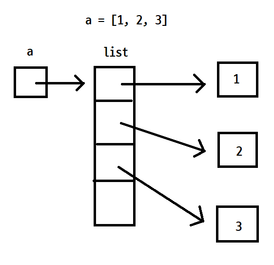
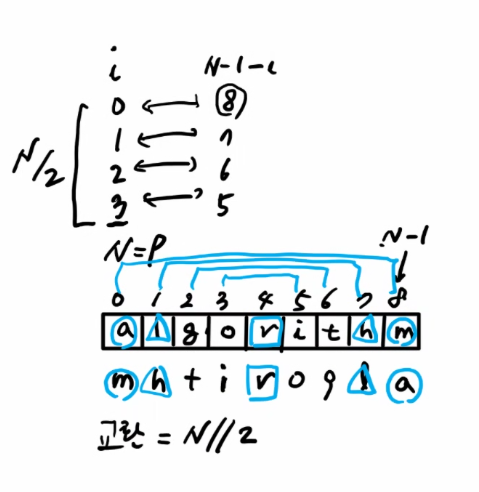
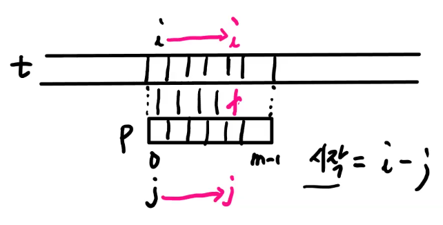

# 20220216


## String

파이썬에서 문자열의 특징

* immutable
  * 문자열에 포함된 일부를 직접 수정할 수 없기 때문에
  * 수정된 새로운 문자열을 생성하던가,
  * 아니면, 리스트에 각 문자를 분리해서 저장해서 수정
* iterable
  * `list(iteralbe)`
  * `list('abcde')` --> `['a', 'b', 'c']`
* sequence
  * `index` 로 개별 문자를 읽을 수 있다. 수정 NONONO!!


----


### 문자열에 사용할 수 있는 `연산자`

* `[]` (indexing)
* `+`  (concatenation)
* `*` 
* 비교 (`< > ==`)


----

### 문자열 처리

* 문자열의 길이

  * len(문자열)

* 문자열 비교

  * `< > ==`

  * == 연산자와 is 연산자 차이

    ```python
    s1 = 'abc'
    s2 = 'abc'
    s3 = 'def'
    s4 = s1
    s5 = s1[:2] + 'c'
    
    print(s1 == s2) # True
    print(s1 is s2) # True
    print(s1 == s3) # False
    print(s1 is s3) # False
    print(s1 == s4) # True
    print(s1 is s4) # True
    print(s1 == s5) # True
    print(s1 is s5) # False
    ```

    * == 연산자는 같은 문자열인지, is 연산자는 같은 주소를 참조하고 있는지 확인한다.

      

* 숫자 문자열을 정수로 변환

  * `int(문자열)`

  * [1, 2, 3, 4] ==> 1234

    ```python
    arr = [1, 2, 3, 4]
    arr = '1234' # 숫자 문자열
    result = 0
    for digit in arr:
        # digit -> ascii(UNICODE) 코드 값
       result = result * 10 + ord(digit) - ord('0') # 문자 0~9는 순서대로 배치되어 있음
    print(result)
    # =====================
    arr = [1, 2, 3, 4]
    result = 0
    for digit in arr:
       result = result * 10 + digit
    print(result)
    # =====================
    arr = [1, 2, 3, 4]
    print(int(''.join(map(str, arr))))
    ```

    

* 정수를 한자리씩 쪼개기

  * 1234 --> [1, 2, 3, 4]

  * 1234 --> '1234'

    ```python
    arr = []
    num = 1234
    
    while num:
        arr = [num % 10] + arr
        num = num // 10
    print(arr)
    
    # =====================
    # 정수를 문자열
    arr = ''
    num = 1234
    
    while num:
        n = chr(ord('0') + num % 10)
        arr = n + arr
        num = num // 10
    print(arr, type(arr)) # 1234 <class 'str'>
    ```

* 문자열 뒤집기

  * 뒤집기

    ```python
    arr1 = 'algorithm'
    arr2 = arr1[::]
    arr3 = arr1[::-1]
    print(arr1) # algorithm
    print(arr2) # algorithm
    print(arr3) # mhtirogla
    print(id(arr1), id(arr2), id(arr3)) # 1654832577712 1654832577712 1654837619376
    ```

  * python에서 배열이 주소 참조하는 방식
    * a 는 리스트의 주소를 참조
    * list의 각 index는 value값 주소를 참조

  ​	

  

  * 교환을 통한 문자열 뒤집기

    * 문자열 자체는 수정이 불가하므로 리스트로 변환해서 수행

      ```python
      arr = list('algorithm')
      N = len(arr)
      for i in range(N // 2):
          arr[i], arr[N - 1 - i] = arr[N - 1 - i], arr[i]
      
      print(arr) # ['m', 'h', 't', 'i', 'r', 'o', 'g', 'l', 'a']
      ```

      

    


---


### 패턴 매칭

* 텍스트에서 패턴이 존재하는 모든 위치를 찾는 문제
  * 텍스트 <- 긴 문자열, 패턴 -> 짧은 문자열
  * 관례적으로 쓰는 표현들
    * 텍스트 => t[], 패턴 => p[]
    * 텍스트의 길이 = n, 패턴의 길이 = m
    * 비교를 위해서 t, p의 특정 위치를 가리키기 위해 i, j
* 패턴 매칭에서 중요한 것
  * 비교해서 일치 했을 경우 실행할 것
  * 비교해서 일치 하지 않았을 경우 실행할 것
    * 보통 여기에서 차이가 나고 나뉘어진다.


### 고지식한 알고리즘 (Brute Force) `이건 할줄 알아야 함!`

* 본문 문자열을 처음부터 끝까지 차례대로 순회하면서 일일히 비교하는 방식

* 구간합과 동일한 방법으로..

  ```python
  # 길이 계산
  p = "CATTCCCTGCGCCGC" # pattern
  t = "ATTTGTGCATGTTTGAGCTTTTACGTACGAGAAACTGAACGTACCTACGACATTCCCTGCGCCGCCACCCGCTTTTTGAA"
   # text
  n, m = len(t), len(p)
  
  # 텍스트에서 패턴이 존재할 가능성이 있는 모든 시작 위치
  for i in range(n - m + 1):
      for j in range(m):
          if p[j] != t[i + m]:
              break
      else:
          print(p)
          print(t[i:i + m])
  ```





```python
i = j = 0

while i < n and j < m:
    # 일치한 경우
    if t[i] == p[j]:
        i += 1
        j += 1
    else: # 불일치한 경우
        i = i - j + 1
        j = 0
if j == m:
    print(t[i - j:])

# ===================

i = j = 0

while i < n and j < m:
    # 일치한 경우
    if t[i] != p[j]:
        i = i - j
        j = -1
    i += 1
    j += 1
if j == m:
    print(t[i - j:])
```


#####   `kmp, 보이어-무어는 이런게 있다는것 정도만 알고 있을것! 시험에 구현하라고 나오지는 않음...`


### KMP 알고리즘

* 매칭이 실패했을 때 돌아갈 곳을 계산하는 방법

  ```python
  def kmp(t, p):
      N = len(t)
      M = len(p)
      lps = [0] * (M + 1)
  
      j = 0 # 일치한 개수 == 비교할 패턴 위치
      lps[0] = -1
      for i in range(1, M):
          lps[i] = j          # p[i] 이전에 일치한 개수
          if p[i] == p[j]:
              j +=1
          else:
              j = 0
      lps[M] = j
      # search
      i = 0 # 비교할 텍스트 위치
      j = 0 # 비교할 패턴 위치
      while i < N and j <= M:
          if j==-1 or t[i] == p[j]:       # 첫글자가 불일치했거나, 일치하면
              i += 1
              j+= 1
          else:           # 불일치
              j = lps[j]
          if j==M:        # 패턴을 찾을 경우
              print(i-M, end = ' ')   # 패턴의 인덱스 출력
              j = lps[j]
  
      print()
      return
  ```


### 보이어-무어 알고리즘

* 오른쪽에서 왼쪽으로 비교

  

## 특이사항


* 2월 17일 실습에 브루트 포스로 찾는 실습 문제 나옴!
  * 여기서는 한개만 찾고 끝내면 됨!


* GNS 문제
  * 제출 해야하는 문제
  * 힌트 : 문자를 숫자로 변환하여 정렬할 것!