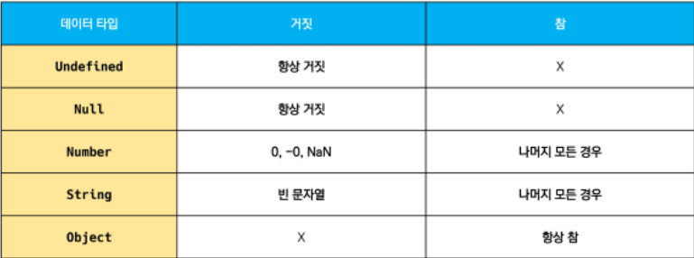
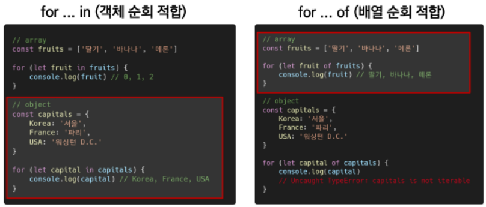
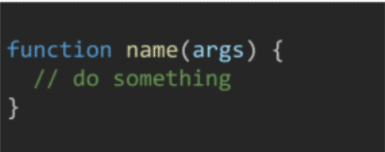
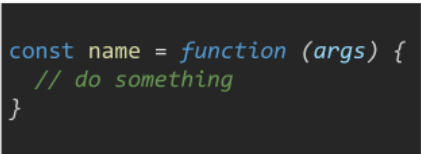
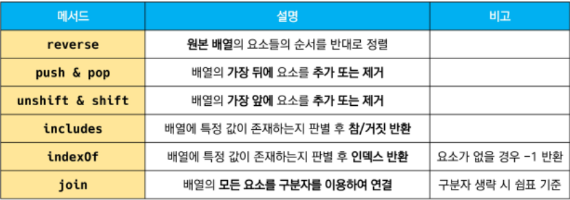
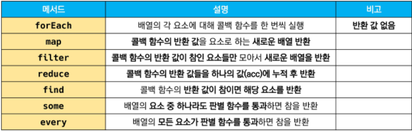

# 20220501


## 식별자

* 카멜 케이스
  * 변수, 객체, 함수
* 파스칼 케이스
  * 클래스, 생성자
* 스네이크 케이스
  * 상수


## let, const, var

* let
  * **재할당 할 예정인** 변수 선언시 사용
  * 변수 **재선언 불가능**
    * SyntaxError
  * 블록 스코프

* const
  * **재할당 할 예정이 없는** 변수 선언시 사용
    * TypeError
  * 변수 **재선언 불가능**
    * SyntaxError
  * 블록 스코프

* 블록 스코프
  * if, for, 함수 등의 중괄호 내부를 가리킴
  * 블록 바깥에서 접근 불가능

* var
  * 재선언 및 재할당 모두 가능
  * 호이스팅 되는 특성으로 예기치 못한 문제 발생 가능
  * 함수 스코프
* 함수 스코프
  * 함수 바깥에서 접근 불가능
    * ReferenceError
* 호이스팅
  * 변수를 선언 이전에 참조할 수 있는 현상
  * undefined를 반환


## 데이터 타입

* 원시 타입
  * 숫자 타입
    * 계산 불가능한경우, NaN 반환
  * 문자열 타입
    * 템플릿 리터럴: backtick(``)으로 표현, 포현식 삽입 가능
  * undefined
    * 변수의 값이 없음을 나타내는 데이터 타입
  * null
    * 변수의 값이 없음을 의도적으로 표현할 때 사용
    * typeof 연산자의 결과는 **object**로 표현
  * Boolean 타입
  * 

* 참조 타입


## 연산자

* 동등 비교 연산자 ==
  * 암묵적 형 변환을 통해 타입을 일치시킨 후 같은 값인지 비교
* 일치 비교 연산자 ===
  * 암묵적 현 변환이 일어나지 않음


## 조건문

* switch
  * break 및 default문은 선택적 사용 가능
  * break문이 없는 경우, break문을 만나거나 default문을 실행할 때까지 다음 조건문 실행


## 반복문




## 함수


### 함수 선언식



* 익명 함수 불가능
* 호이스팅 O

### 함수 표현식



* 익명 함수 가능
* 호이스팅 X
  * var 선언시 변수가 undefined로 초기화 되어 다른 에러가 발생

* 매개변수와 인자의 개수 불일치 허용
  * 많을경우, 갯수에 맞춰서, 적을 경우, 나머지는 undefined

* Rest Parameter
* spread operator


## 화살표 함수

* function 키워드 생략 가능
* 매개변수가 하나일 경우, 소괄호 생략가능
* 표현식 하나일 경우, 중괄호와 return 생략 가능


## 배열 메소드






### forEach

* array.forEach(callback(element[, index[, array]])

  ```js
  array.forEach((element, index, array) => {})
  ```

  

### map

* array.map(callback(element[, index[, array]]))

  

### filter

* array.filter(callback(element[, index[, array]]))


### reduce

* array.reduce(callback(acc, element, [index[, array]]))[, initialValue])

```js
array.reduce((acc, element, index, array) => {}, initialValue)
```

* 배열의 각 요소에 대해 콜백 함수를 한 번씩 실행
  * acc
    * return 값이 누적되는 변수
  * initialValue
    * 최초 함수 호출 시 acc에 할당되는 값, default값은 배열의 첫 번째 값
  * 빈 배열의 경우, initialValue를 제공하지 않으면 에러 발생

### some

* 빈 배열은 항상 거짓 반환

### every

* 빈 배열은 항상 참 반환


## 객체

* 속성명 축약
  * key와 할당하는 변수의 이름이 같으면 축약 가능
* 메서드명 축약
  * 메서드 선언시 function 키워드 생략 가능
* 구조 분해 할당
  * 배열 또는 객체를 분해하여 속성을 변수에 쉽게 할당할 수 있는 문법


## DOM 조작

* document.querySelector(selector)
  * 선택자와 일치하는 element 하나 선택
  * 첫번째 element 객체 를 반환
* document.querySelectorAll(selector)
  * 선택자와 일치하는 element 여러개 선택
  * NodeList 반환
  * Static Collection
    * 실시간으로 반영되지 않음
* Live Collection
  * 실시간으로 반영됨
  * NodeList
  * HTMLCollection


### document.createElement()

* Element.append()
  * Node의 자식 NodeList 중 마지막 자식 다음에 Node 객체나 DOMString을 삽입
  * 여러개 가능
  * 반환값 X
* Node.appendChild()
  * 특정 부모 Node의 자식 NodeList 중 마지막 자식으로 삽입 (Node만 가능)
  * 오직 하나의 Node만 추가할 수 있음
* Node.innerText
  * Node 객체와 그 자손의 텍스트 컨텐츠를 표현
* Element.innerHTML
  * 요소 내에 포함된 HTML 마크업을 반환
  * XSS 공격에 취약


### DOM 삭제 

* ChildNode.remove()
* Node.removeChild()
  * DOM에서 자식 Node를 제거하고 제거된 Node를 반환


### DOM 속성

* Element.setAttribute(name, value)
  * 지정된 요소의 값을 설정
  * 속성이 이미 존재하면 값을 갱신, 존재하지 않으면 지정된 이름과 값으로 새 속성을 추가


### addEventListener

* target.addEventListener(type, listener[, options])
  * type
    * 반응 할 이벤트 유형
  * listener
    * 지정된 타입의 이벤트가 발생했을 때 알림을 받는 객체
      * 콜백 함수


### Event 취소

* event.preventDefault()