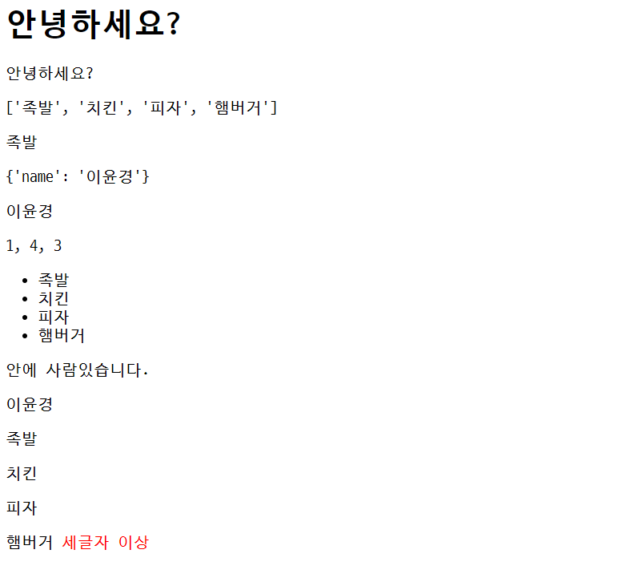

# 20220302


## Django 01


### 핵심 키워드

* 클라이언트
  * 디바이스, 프로그램
  * 웹 브라우저
* 서버
  * django 프레임워크
* 요청
* 응답


### Static web page

* 서버에 미리 저장된 파일이 사용자에게 그대로 전달되는 웹 페이지
* 요청을 받은 경우, 서버는 추가적인 처리 과정 없이 클라이언트에게 응답을 보냄
* HTML. CSS, JavaScript 로 작성됨
* flat page 라고도 함


### Dynamic web page

* 웹 페이지에 대한 요청을 받은 경우 서버는 추가적인 처리 과정 이후 클라이언트에게 응답을 보냄
* 서버 사이드 프로그래밍 언어가 사용되며 파일을 처리, 데이터베이스와의 상호작용이 이루어짐


### Framework

* 라이브러리 모음


### Framework Architecture

* MVC Design Pattern (model -view-controller)
* 소프트웨어 공학에서 사용되는 디자인 패턴 중 하나
* Django는 MTV Pattern이라고 함


### MTV Pattern

* Model
* Template
  * 파일의 구조나 레이아웃
  * 실제 내용을 보여줌
* View
  * HTTP 요청을 수신하고 HTTP 응답을 반환


## 앞으로 지겹도록 할거


### 1. 가상환경 생성 및 활성화

```bash
$ python -m venv venv
$ source venv/Scripts/activate
```

* 비활성화

```bash
$ deactivate
```

* VScode에서 가상환경 설정
  * ctrl + shift + p 하고 python select interpreter
  * 이후, 터미널 다시 실행할 것


### 2. django 설치

```bash
$ pip install django==3.2.12
$ pip list
```

* 반드시 패키지를 설치하면 freeze 한다.

```bash
$ pip freeze > requirements.txt
```

* 읽어와서 설치하기

```bash
$ pip install -r requirements.txt
```


### 3. 프로젝트 생성

* `.gitignore` 생성하기

```bash
$ django-admin startproject <프로젝트 이름> .
```


### 4. 서버 켜서 로켓 확인하기

```bash
$ python manage.py runserver
```

* 종료는 `ctrl + c`

  

### 5. 앱 생성

* **[중요]** 앱을 생성하고 `setting.py`에 등록할 것

* `INSTALLED_APPS`에 등록하고 앱을 생성하면 오류 메시지 출력

  

### 6. 앱 등록


### 프로젝트 구조

* setting
* urls
  * 모든 request는 urls.py에 들어온다. 
  * 그 request를 처리할 함수들을 등록한다.


### Application 구조

* 터치하지 말것
  * __init__
  * apps
  * tests


### Project & Application

* Project
  * 앱의 집합
  * 프로젝트에는 여러 앱이 포함될 수 있음
  * 프로젝트에서 앱을 실행하기위해서는 앱을 등록해야 한다.
* Application
  * 하나의 역할 및 기능 단위로 작성


### view

* 무조건 request를 인자로 받아야함

```python
def index(request):
    pass
```


### templates

* 폴더는 반드시 article에 생성
* 내부에 html 문서 작성


### LANGUAGE_CODE

* 언어 변환 설정

* 'ko-kr'

  

### TIME_ZONE

* 기준 시간 설정
* 'Asia/Seoul'


### django 공식 문서

* 구글에서 검색해서 갈 것!


## Django Template

* 데이터 표현을 제어하는 도구이자 표현에 관련된 로직
* 사용하는 built-in system
  * Django template language


### DTL (Django Template Language)

* 조건, 반복, 변수 치환, 필터 등의 기능을 제공
* Python 코드로 실행되는 것이 아님!!!
* 표현하기 위한 것일 뿐.


### DTL Syntax

* Variable

  ```django
  {{ variable }}
  ```

  * render()의 세번째 인자로 딕셔너리 형태로 넘겨준다.
  * key가 template에서 사용 가능한 값.

  ```html
  <p>안녕하세요 저는 {{ name }}입니다.</p>
  ```

  

* Filters

  ```django
  {{ variable|filter }}
  ```

  * 변수에 filter가 적용
  * chained가 가능하며, 일부 필터는 인자를 받기도 함

  ```django
  {{ variable|truncatewords:30 }}
  ```

  

* Tags

  ```django
  
  ```

  * 반복 또는 논리를 수행하여 제어 흐름을 만듦

  ```django
  
  ```

  * 일부 태그는 시작과 종료 태그가 필요

  ```django
  
    <li>{{ food }}</li>
  
  ```

  

* Comments

  ```django
  {# #}
  ```

  * 주석 처리
  * 위는 한줄 주석

  ```django
  
  주석
  주석
  
  ```

  * 이건 여러줄 주석


### Template inheritance (템플릿 상속)

* 코드의 재사용성에 초점을 맞춤

* 템플릿 작성 위치를 추가 가능

  * setting에서 가능

  ```python
  'DIRS': [BASE_DIR / 'templates',] # 이곳에 등록
  ```

  


## 코드 작성 순서

### URL -> VIEW -> TEMPLATE

* 데이터 흐름 순서 대로 작성


```django
{{ info.name }}
```


```django
<h1>안녕하세요?</h1>

<p> 안녕하세요? {{ name }} </p>
<p> {{ foods }} </p>
<p> {{ foods.0 }} </p>
<p> {{ info }} </p>
<p> {{ info.name }} </p>
<p> {{ info|length }}, {{ foods|length }}, {{ info.name|length }} </p>

<ul>
  
    <li> {{ food }} </li>
  
</ul>


  <p>안에 사람있습니다.</p>

  <p>빈 리스트입니다.</p>



  <p>{{user}}</p>

  <p>빈 유저 리스트입니다.</p>



  <p> 
    {{ food }}
    
      <span style="color : {{ color }}">세글자 이상</span>
    
  </p>

```


