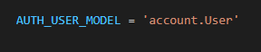

# 20220414

## Substituting a custom User model

* Django에서는 커스텀 유저 모델을 설정하는 것을 강력하게 권장
* User를 참조하는데 사용하는 **AUTH_USER_MODEL** 값을 제공

### AUTH_USER_MODEL

* User를 나타내는데 사용하는 모델
* 프로젝트가 진행되는 동안 변경할 수 없음

### Custom User 모델 정의하기

* 관리자 권한과 함께 완전한 기능을 갖춘 User 모델을 구현하는 기본 클래스인 AbstractUser를 상속받아 새로운 User 모델 작성

  

* 기존에 Django가 사용하는 User 모델이었던 auth 앱의 User 모델을 accounts 앱의 User 모델을 사용하도록 변경

  

* admin site에 Custom User 모델 등록

  

* 프로젝트 중간에 진행했기 때문에 데이터베이스를 초기화 한 후 마이그레이션 진행

  * db.sqlited3 파일 삭제
  * migrations 파일 모두 삭제

## Custom user & Built-in auth forms

* UserCreationForm과 UserChangeForm은 기존 내장 User 모델을 사용한 ModelForm이기 때문에 커스텀 User 모델로 대체해야 한다.
  * User 모델을 사용하는 모델
    * UserCreationForm
    * UserChangeForm

#### get_user_model()

* 현재 프로젝트에서 활성화된 사용자 모델을 반환
  * User 모델을 커스터마이징한 상황에서는 Custom User모델을 반환

### field_order

* field의 순서를 재정의, 튜플로 정의한다.

## User - Article(1:N)

* settings.AUTH_USER_MODEL
  * models.py에서 User 모델을 참조할 때 사용
* get_user_model()
  * models.py가 아닌 다른 다른 모든 곳에서 유저 모델을 참조할 때 사용

### User와 Article 간 모델 관계 정의 후 migration

## 팁

User.objects.all().count : 갯수 출력

Making Query

QuerySet API

filter()

values()

order_by()

annotate()