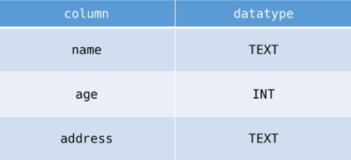

# 20220418


## 데이터 베이스로 얻는 장점

* 데이터 중복 최소화
* 데이터 무결성
* 데이터 일관성
* 데이터 독립성
* 데이터 표준화


## 스키마

* 자료의 구조, 표현방법, 관계등 명세를 기술한 것


## 테이블

* 열(컬럼/필드)와 행(레코드/값)의 모델을 사용해 조직된 데이터 요소들의 집합


## SQlite Data Type

* NULL
* INTEGER
* REAL
* TEXT
* BLOB


## Sqlite Type Affinity

* INTEGER
* TEXT
* BLOB
* REAL
* NUMERIC


## SQL 분류

* DDL
  * 데이터 정의 언어
  * CREATE, DROP, ALTER
* DML
  * 데이터 조작 언어
  * INSERT, SELECT, UPDATE, DELETE
* DCL
  * 데이터 제어 언어
  * GRANT, REVOKE, COMMIT, ROLLBACK


## CSV 파일을 table로 만들기

```sqlite
.mode csv
.import hellodb.csv examples
.tables
```


## 테이블 생성 및 삭제

* CREATE TABLE

  * 테이블 생성

    

    ```sqlite
    CREATE TABLE classmates(
    name TEXT,
    age INT,
    address TEXT
    );
    ```

    

* DROP TABLE

  * 테이블 제거


## CRUD

### CREATE

* INSERT

  ```sqlite
  INSERT INTO 테이블이름 (컬럼1, 컬럼2, ...) VALUES (값1, 값2, ...);
  ```

  * 모든 열에 데이터가 있는 경우 column을 명시하지 않아도 된다.
  * rowid
    * SQLite에서 PRIMARY KEY 속성의 칼럼을 작성하지 않으면 정의함
  * NOT NULL
    * 반드시 필요한 정보일 경우 설정

```sqlite
CREATE TABLE classmates (
id INTEGER PRIMARY KEY,
name TEXT NOT NULL,
age INT NOT NULL,
address TEXT NOT NULL
);
```

* 스키마에 id를 직접 작성할 경우, 모든 column을 작성하여야 입력이 된다.

* 방법 2가지

  * id를 포함한 모든 value를 작성

    ```sqlite
    INSERT INTO classmates VALUES (1, '홍길동', 30, '서울');
    ```

  * 각 value에 맞는 column들을 명시적으로 작성

    ```sqlite
    INSERT INTO classmates (name, age, address) VALUES ('홍길동', 30, '서울');
    ```

* INSERT INTO시, VALUES 뒤에 여러개를 동시 입력 가능


### READ

* SELECT

  * LIMIT
    * 쿼리에서 반환되는 행 수를 제한
  * OFFSET
  * WHERE
    * 검색 조건 지정
  * SELECT DISTINCT
    * 중복 행을 제거

* 특정 컬럼만 조회하기

  ```sqlite
  SELECT rowid, name FROM classmates;
  ```

* 원하는 수 만큼 데이터 조회하기

  ```sqlite
  SELECT rowid, name FROM classmtes LIMIT 1;
  ```

  * 하나만 조회하기(LIMIT는 갯수, OFFSET은 시작점)

* 특정 부분에서 원하는 수만큼 데이터 조회하기

  * 세번째에 있는 하나만 조회하기

  ```sqlite
  SELECT rowid, name FROM classmates LIMIT 1 OFFSET 2;
  ```

* 특정 조건 데이터 조회하기

  * 주소가 서울인 경우의 데이터를 조회하기

  ```sqlite
  SELECT rowid, name FROM classmates WHERE address='서울';
  ```

* 특정 컬럼을 기준으로 중복없이 가져오기

  * age값 전체를 중복없이 조회하기

  ```sqlite
  SELECT DISTINCT age FROM classmates;
  ```


### DELETE

* 특정 조건으로 삭제하기

  * id값이 5인 레코드 삭제하기

  ```sqlite
  DELETE FROM classmates WHERE rowid=5;
  ```

* 삭제된 rowid값 다시 사용하지 않게 하기

  * AUTOINCREMENT

    * 테이블을 생성하는 단계에서 설정.

    ```sqlite
    CREATE TABLE 테이블이름 (
    id INTEGER PRIMARY KEY AUTOINCREMENT,
    )
    ```


### UPDATE

* 조건을 통해 특정 레코드 수정하기

```sqlite
UPDATE classmates SET name='홍길동', address='제주도' WHERE rowid=5;
```


## WHERE 활용

* users 테이블에서 age가 30이상이고 성이 '김'인 사람의 나이와 성만 조회

```sqlite
SELECT age, last_name FROM users WHERE age>=30 AND last_name='김';
```


## Aggregate function

* 집계 함수

  * COUNT

    ```sqlite
    SELECT COUNT(칼럼) FROM 테이블이름;
    ```

  * AVG

    ```sqlite
    SELECT AVG(balance) FROM users WHERE age>=30;
    ```

  * MAX

    ```sqlite
    SELECT first_name, MAX(balance) FROm users;
    ```

  * MIN

  * SUM


### LIKE operator

* wildcards
  * %
    * 0개 이상의 문자
  * _
    * 임의의 단일 문자

* users 테이블에서 20대인 사람만 조회하기

  ```sqlite
  SELECT * FROM users WHERE age LIKE '2_';
  ```

* users 테이블에서 중간 번호가 5114인 사람만 조회하기

  ```sqlite
  SELECT * FROM users WHERE phone LIKE '%-5114-%';
  ```

  

### ORDER BY

* 조회 결과 집합을 정렬
* SELECT 문에 추가하여 사용
  * ASC
    * 오름차순
  * DESC
    * 내림차순
* users 에서 나이 순으로 오름차순 정렬하여 상위 10개만 조회

```sqlite
SELECT * FROM users ORDER BY age ASC LIMIT 10;
```

* 계좌 잔액 순으로 내림차순 정렬하여 해당 유저의 성과 이름을 10개만 조회

```sqlite
SELECT last_name, first_name FROM users ORDER BY balance DESC LIMIT 10;
```


## GROUP BY

* 지정된 기준에 따라 행 세트를 그룹으로 결합

* users에서 각 성씨가 몇 명씩 있는지 조회

```sqlite
SELECT last_name, COUNT(*) AS name_count FROM users GROUP BY last_name
```


## ALTER TABLE

* 3가지 기능

  * table 이름 변경

    ```sqlite
    ALTER TABLE articles RENAME TO news;
    ```

    

  * 테이블에 새로운 column 추가

    ```sqlite
    ALTER TABLE news ADD COLUMN created_at TEXT NOT NULL;
    ```

    * 실패( 기존 레코드들에는 새로 추가되는 필드에 대한 정보가 X)

      * NOT NULL 없이 추가하기

      * 기본 값 설정하기

        ```sqlite
        ALTER TABLE news ADD COLUMN created_at TEXT NOT NULL DEFAULT '소제목';
        ```

        

  * column 이름 수정


## Foregin Key

* 키를 사용하여 부모 테이블의 유일한 값을 참조 (참조 무결성)

* 2개의 위치인자가 반드시 필요
  * 참조하는 model class
  * on_delete 옵션

* migrate 작업시 필드 이름에 _id를 추가하여 데이터베이스 열 이름을 만듦
* related_name
  * 사용시, comment_set으로 역참조 불가능, 작성한 값으로 역참조
    * 수정후, migration 과정 필요


### 역참조

**Article(1) -> Comment(N)**

* article.comment_set


### 참조

**Comment(N) -> Article(1)**

* comment.article


## HW

## 1.

### 1) T

### 2) T

### 3) F

