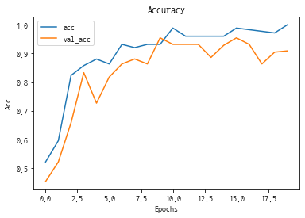
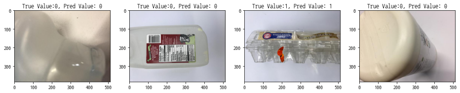

# [실습] Python을 활용한 AI 모델링 - 딥러닝 파트
+ 이번시간에는 Python을 활용한 AI 모델링에서 딥러닝에 대해 실습해 보겠습니다.
+ 여기서는 딥러닝 모델 DNN, CNN, RNN 에 대해 코딩하여 모델 구축해 보겠습니다.
+ 한가지 당부 드리고 싶은 말은 "백문이불여일타" 입니다. 
+ 이론보다 실습이 더 많은 시간과 노력이 투자 되어야 합니다.

## 학습목차
1. 실습을 위한 KT AIDU 환경변수 설정
2. 딥러닝 모델(DNN, CNN, RNN) 프로세스
 - 데이터 가져오기
 - 데이터 전처리
 - Train, Test 데이터셋 분할
 - 데이터 정규화
 - 딥러닝 모델 : DNN, CNN, RNN

# 
# 1. 실습을 위한 KT AIDU 환경변수 설정


```python
# 코드실행시 경고 메시지 무시

import warnings
warnings.filterwarnings(action='ignore') 
```

##### AIDU 라이브러리 임포트


```python
from aicentro.session import Session
from aicentro.framework.keras import Keras as AiduFrm

aidu_session = Session(verify=False)
aidu_framework = AiduFrm(session=aidu_session)
```

##### AIDU 디렉토리 환경변수

- data 경로:         aidu_framework.config.data_dir


```python
# aidu_framework.config.data_dir 내용 확인
aidu_framework.config.data_dir
```


    '/aihub/data'


# 
# 2. 딥러닝 모델(DNN, CNN, RNN) 프로세스
① 라이브러리 임포트(import)  
② 데이터 가져오기(Loading the data)  
③ 탐색적 데이터 분석(Exploratory Data Analysis)  
④ 데이터 전처리(Data PreProcessing) : 데이터타입 변환, Null 데이터 처리, 누락데이터 처리, 
더미특성 생성, 특성 추출 (feature engineering) 등  
⑤ Train, Test  데이터셋 분할  
⑥ 데이터 정규화(Normalizing the Data)  
⑦ 모델 개발(Creating the Model)  
⑧ 모델 성능 평가

## ① 라이브러리 임포트

##### 필요 라이브러리 임포트


```python
import numpy as np
import pandas as pd
import matplotlib.pyplot as plt
```

## ② 데이터 로드


```python
#고객등급(cust_class), 성별(sex_type), 나이(age), 사용서비스수(efct_svc_count), 서비스중지여부 (dt_stop_yn), 미납여부(npay_yn)
#3개월 평균 요금(r3m_avg_bill_amt), A서비스 3개월 평균요금(r3m_A_avg_arpu_amt), B서비스 3개월 평균요금(r3m_B_avg_arpu_amt), 해지여부(termination_yn)

df = pd.read_csv('cust_data.csv')
```

## ③ 데이터 분석


```python
# 12컬럼, 7814 라인
df.info()
```

    <class 'pandas.core.frame.DataFrame'>
    RangeIndex: 7814 entries, 0 to 7813
    Data columns (total 12 columns):
     #   Column       Non-Null Count  Dtype  
    ---  ------       --------------  -----  
     0   class        7814 non-null   object 
     1   sex          7814 non-null   object 
     2   age          7814 non-null   int64  
     3   service      7814 non-null   int64  
     4   stop         7814 non-null   object 
     5   npay         7814 non-null   object 
     6   avg_bill     7814 non-null   float64
     7   A_bill       7814 non-null   float64
     8   B_bill       7814 non-null   float64
     9   termination  7814 non-null   object 
     10  by_age       7814 non-null   int64  
     11  bill_rating  7814 non-null   object 
    dtypes: float64(3), int64(3), object(6)
    memory usage: 732.7+ KB


```python
df.tail()
```


<div>
<style scoped>
    .dataframe tbody tr th:only-of-type {
        vertical-align: middle;
    }

    .dataframe tbody tr th {
        vertical-align: top;
    }

    .dataframe thead th {
        text-align: right;
    }
</style>
<table border="1" class="dataframe">
  <thead>
    <tr style="text-align: right;">
      <th></th>
      <th>class</th>
      <th>sex</th>
      <th>age</th>
      <th>service</th>
      <th>stop</th>
      <th>npay</th>
      <th>avg_bill</th>
      <th>A_bill</th>
      <th>B_bill</th>
      <th>termination</th>
      <th>by_age</th>
      <th>bill_rating</th>
    </tr>
  </thead>
  <tbody>
    <tr>
      <th>7809</th>
      <td>C</td>
      <td>M</td>
      <td>76</td>
      <td>1</td>
      <td>N</td>
      <td>N</td>
      <td>1860.0000</td>
      <td>1716.000000</td>
      <td>0.0000</td>
      <td>N</td>
      <td>75</td>
      <td>low</td>
    </tr>
    <tr>
      <th>7810</th>
      <td>C</td>
      <td>F</td>
      <td>15</td>
      <td>1</td>
      <td>N</td>
      <td>Y</td>
      <td>1296.0999</td>
      <td>194.414985</td>
      <td>643.1001</td>
      <td>N</td>
      <td>15</td>
      <td>low</td>
    </tr>
    <tr>
      <th>7811</th>
      <td>G</td>
      <td>M</td>
      <td>12</td>
      <td>1</td>
      <td>N</td>
      <td>N</td>
      <td>13799.6666</td>
      <td>2069.949990</td>
      <td>10605.9266</td>
      <td>N</td>
      <td>10</td>
      <td>midhigh</td>
    </tr>
    <tr>
      <th>7812</th>
      <td>C</td>
      <td>F</td>
      <td>40</td>
      <td>0</td>
      <td>N</td>
      <td>N</td>
      <td>3140.0000</td>
      <td>942.000000</td>
      <td>1884.0000</td>
      <td>Y</td>
      <td>40</td>
      <td>low</td>
    </tr>
    <tr>
      <th>7813</th>
      <td>C</td>
      <td>F</td>
      <td>59</td>
      <td>1</td>
      <td>N</td>
      <td>N</td>
      <td>2436.9000</td>
      <td>365.535000</td>
      <td>1839.9000</td>
      <td>N</td>
      <td>55</td>
      <td>low</td>
    </tr>
  </tbody>
</table>
</div>


```python
# termination 레이블 불균형 
df['termination'].value_counts().plot(kind='bar')
```


    <matplotlib.axes._subplots.AxesSubplot at 0x7f602e35b940>


    

    


## ④ 데이터 전처리

+ Object 컬럼에 대해 Pandas get_dummies 함수 활용하여 One-Hot-Encoding


```python
cal_cols = ['class', 'sex', 'stop', 'npay', 'termination', 'bill_rating']
```


```python
df1 = pd.get_dummies(data=df, columns=cal_cols, drop_first=True)
```


```python
# 19컬럼, 7814 라인
df1.info()
```

    <class 'pandas.core.frame.DataFrame'>
    RangeIndex: 7814 entries, 0 to 7813
    Data columns (total 19 columns):
     #   Column               Non-Null Count  Dtype  
    ---  ------               --------------  -----  
     0   age                  7814 non-null   int64  
     1   service              7814 non-null   int64  
     2   avg_bill             7814 non-null   float64
     3   A_bill               7814 non-null   float64
     4   B_bill               7814 non-null   float64
     5   by_age               7814 non-null   int64  
     6   class_D              7814 non-null   uint8  
     7   class_E              7814 non-null   uint8  
     8   class_F              7814 non-null   uint8  
     9   class_G              7814 non-null   uint8  
     10  class_H              7814 non-null   uint8  
     11  sex_M                7814 non-null   uint8  
     12  stop_Y               7814 non-null   uint8  
     13  npay_Y               7814 non-null   uint8  
     14  termination_Y        7814 non-null   uint8  
     15  bill_rating_low      7814 non-null   uint8  
     16  bill_rating_lowmid   7814 non-null   uint8  
     17  bill_rating_mid      7814 non-null   uint8  
     18  bill_rating_midhigh  7814 non-null   uint8  
    dtypes: float64(3), int64(3), uint8(13)
    memory usage: 465.6 KB


## ⑤ Train, Test  데이터셋 분할


```python
from sklearn.model_selection import train_test_split
```


```python
X = df1.drop('termination_Y', axis=1).values
y = df1['termination_Y'].values
```


```python
X_train, X_test, y_train, y_test = train_test_split(X, y, 
                                                    test_size=0.3, 
                                                    stratify=y,
                                                    random_state=42)
```


```python
X_train.shape
```


    (5469, 18)


```python
y_train.shape
```


    (5469,)


## ⑥ 데이터 정규화/스케일링(Normalizing/Scaling)


```python
# 숫자 분포 이루어진 컬럼 확인
df1.tail()
```


<div>
<style scoped>
    .dataframe tbody tr th:only-of-type {
        vertical-align: middle;
    }

    .dataframe tbody tr th {
        vertical-align: top;
    }

    .dataframe thead th {
        text-align: right;
    }
</style>
<table border="1" class="dataframe">
  <thead>
    <tr style="text-align: right;">
      <th></th>
      <th>age</th>
      <th>service</th>
      <th>avg_bill</th>
      <th>A_bill</th>
      <th>B_bill</th>
      <th>by_age</th>
      <th>class_D</th>
      <th>class_E</th>
      <th>class_F</th>
      <th>class_G</th>
      <th>class_H</th>
      <th>sex_M</th>
      <th>stop_Y</th>
      <th>npay_Y</th>
      <th>termination_Y</th>
      <th>bill_rating_low</th>
      <th>bill_rating_lowmid</th>
      <th>bill_rating_mid</th>
      <th>bill_rating_midhigh</th>
    </tr>
  </thead>
  <tbody>
    <tr>
      <th>7809</th>
      <td>76</td>
      <td>1</td>
      <td>1860.0000</td>
      <td>1716.000000</td>
      <td>0.0000</td>
      <td>75</td>
      <td>0</td>
      <td>0</td>
      <td>0</td>
      <td>0</td>
      <td>0</td>
      <td>1</td>
      <td>0</td>
      <td>0</td>
      <td>0</td>
      <td>1</td>
      <td>0</td>
      <td>0</td>
      <td>0</td>
    </tr>
    <tr>
      <th>7810</th>
      <td>15</td>
      <td>1</td>
      <td>1296.0999</td>
      <td>194.414985</td>
      <td>643.1001</td>
      <td>15</td>
      <td>0</td>
      <td>0</td>
      <td>0</td>
      <td>0</td>
      <td>0</td>
      <td>0</td>
      <td>0</td>
      <td>1</td>
      <td>0</td>
      <td>1</td>
      <td>0</td>
      <td>0</td>
      <td>0</td>
    </tr>
    <tr>
      <th>7811</th>
      <td>12</td>
      <td>1</td>
      <td>13799.6666</td>
      <td>2069.949990</td>
      <td>10605.9266</td>
      <td>10</td>
      <td>0</td>
      <td>0</td>
      <td>0</td>
      <td>1</td>
      <td>0</td>
      <td>1</td>
      <td>0</td>
      <td>0</td>
      <td>0</td>
      <td>0</td>
      <td>0</td>
      <td>0</td>
      <td>1</td>
    </tr>
    <tr>
      <th>7812</th>
      <td>40</td>
      <td>0</td>
      <td>3140.0000</td>
      <td>942.000000</td>
      <td>1884.0000</td>
      <td>40</td>
      <td>0</td>
      <td>0</td>
      <td>0</td>
      <td>0</td>
      <td>0</td>
      <td>0</td>
      <td>0</td>
      <td>0</td>
      <td>1</td>
      <td>1</td>
      <td>0</td>
      <td>0</td>
      <td>0</td>
    </tr>
    <tr>
      <th>7813</th>
      <td>59</td>
      <td>1</td>
      <td>2436.9000</td>
      <td>365.535000</td>
      <td>1839.9000</td>
      <td>55</td>
      <td>0</td>
      <td>0</td>
      <td>0</td>
      <td>0</td>
      <td>0</td>
      <td>0</td>
      <td>0</td>
      <td>0</td>
      <td>0</td>
      <td>1</td>
      <td>0</td>
      <td>0</td>
      <td>0</td>
    </tr>
  </tbody>
</table>
</div>


```python
from sklearn.preprocessing import MinMaxScaler
```


```python
scaler = MinMaxScaler()
X_train = scaler.fit_transform(X_train)
X_test = scaler.transform(X_test)
```


```python
X_train[:2]
```


    array([[0.38      , 0.33333333, 0.4295439 , 0.06384702, 0.41944434,
            0.4       , 0.        , 0.        , 0.        , 0.        ,
            1.        , 1.        , 0.        , 1.        , 0.        ,
            0.        , 0.        , 1.        ],
           [0.58      , 0.11111111, 0.20111297, 0.38498933, 0.        ,
            0.6       , 1.        , 0.        , 0.        , 0.        ,
            0.        , 1.        , 0.        , 0.        , 0.        ,
            1.        , 0.        , 0.        ]])


+ 모델 입력갯수, 출력갯수 확인


```python
X_train.shape
```


    (5469, 18)


```python
y_train.shape
```


    (5469,)


## ⑦ 모델 개발

###  
## 1) DNN

#### 
#### A. 이진 분류용 DNN layer
+ 18개 input layer
+ unit 4개 hidden layer
+ unit 3개 hidden layer 
+ 1개 output layser : 이진분류


+ [출처] https://subscription.packtpub.com/book/data/9781788995207/1/ch01lvl1sec03/deep-learning-intuition


```python
import tensorflow as tf
from tensorflow.keras.models import Sequential
from tensorflow.keras.layers import Dense, Activation, Dropout
```


```python
# 18개 input layer
# unit 4개 hidden layer
# unit 3개 hidden layer 
# 1개 output layser : 이진분류

model = Sequential()
model.add(Dense(4, activation='relu', input_shape=(18,)))
model.add(Dense(3, activation='relu'))
model.add(Dense(1, activation='sigmoid'))
```

#### 모델 확인


```python
model.summary()
```

    Model: "sequential"
    _________________________________________________________________
    Layer (type)                 Output Shape              Param #   
    =================================================================
    dense (Dense)                (None, 4)                 76        
    _________________________________________________________________
    dense_1 (Dense)              (None, 3)                 15        
    _________________________________________________________________
    dense_2 (Dense)              (None, 1)                 4         
    =================================================================
    Total params: 95
    Trainable params: 95
    Non-trainable params: 0
    _________________________________________________________________


#### 모델 컴파일 – 이진 분류 모델


```python
model.compile(optimizer='adam', 
              loss='binary_crossentropy', 
              metrics=['accuracy']) 
```

+ Dropout : 과적합 방지


+ [출처] https://medium.com/@amarbudhiraja/https-medium-com-amarbudhiraja-learning-less-to-learn-better-dropout-in-deep-machine-learning-74334da4bfc5


```python
model = Sequential()
model.add(Dense(4, activation='relu', input_shape=(18,)))
model.add(Dropout(0.3))
model.add(Dense(3, activation='relu'))
model.add(Dropout(0.3))
model.add(Dense(1, activation='sigmoid'))
```


```python
model.summary()
```

    Model: "sequential_1"
    _________________________________________________________________
    Layer (type)                 Output Shape              Param #   
    =================================================================
    dense_3 (Dense)              (None, 4)                 76        
    _________________________________________________________________
    dropout (Dropout)            (None, 4)                 0         
    _________________________________________________________________
    dense_4 (Dense)              (None, 3)                 15        
    _________________________________________________________________
    dropout_1 (Dropout)          (None, 3)                 0         
    _________________________________________________________________
    dense_5 (Dense)              (None, 1)                 4         
    =================================================================
    Total params: 95
    Trainable params: 95
    Non-trainable params: 0
    _________________________________________________________________


#### 모델 컴파일 – 이진 분류 모델


```python
model.compile(optimizer='adam', 
              loss='binary_crossentropy', 
              metrics=['accuracy']) 
```

#### 모델 훈련(학습) 하기


```python
history = model.fit(X_train, y_train, 
          validation_data=(X_test, y_test),
          epochs=20, 
          batch_size=16)
```

    Epoch 1/20
    342/342 [==============================] - 1s 3ms/step - loss: 0.5785 - accuracy: 0.8557 - val_loss: 0.3741 - val_accuracy: 0.8994
    Epoch 2/20
    342/342 [==============================] - 1s 3ms/step - loss: 0.4105 - accuracy: 0.8985 - val_loss: 0.3234 - val_accuracy: 0.8994
    Epoch 3/20
    342/342 [==============================] - 1s 3ms/step - loss: 0.3813 - accuracy: 0.8996 - val_loss: 0.3061 - val_accuracy: 0.8994
    Epoch 4/20
    342/342 [==============================] - 1s 3ms/step - loss: 0.3554 - accuracy: 0.8996 - val_loss: 0.2978 - val_accuracy: 0.8994
    Epoch 5/20
    342/342 [==============================] - 1s 3ms/step - loss: 0.3408 - accuracy: 0.8996 - val_loss: 0.2931 - val_accuracy: 0.8994
    Epoch 6/20
    342/342 [==============================] - 1s 3ms/step - loss: 0.3292 - accuracy: 0.8996 - val_loss: 0.2839 - val_accuracy: 0.8994
    Epoch 7/20
    342/342 [==============================] - 1s 3ms/step - loss: 0.3150 - accuracy: 0.8998 - val_loss: 0.2756 - val_accuracy: 0.8994
    Epoch 8/20
    342/342 [==============================] - 1s 3ms/step - loss: 0.3064 - accuracy: 0.9007 - val_loss: 0.2678 - val_accuracy: 0.8994
    Epoch 9/20
    342/342 [==============================] - 1s 3ms/step - loss: 0.2905 - accuracy: 0.9049 - val_loss: 0.2531 - val_accuracy: 0.8994
    Epoch 10/20
    342/342 [==============================] - 1s 3ms/step - loss: 0.2838 - accuracy: 0.9057 - val_loss: 0.2432 - val_accuracy: 0.8994
    Epoch 11/20
    342/342 [==============================] - 1s 3ms/step - loss: 0.2708 - accuracy: 0.9095 - val_loss: 0.2222 - val_accuracy: 0.8994
    Epoch 12/20
    342/342 [==============================] - 1s 3ms/step - loss: 0.2601 - accuracy: 0.9163 - val_loss: 0.2101 - val_accuracy: 0.8994
    Epoch 13/20
    342/342 [==============================] - 1s 3ms/step - loss: 0.2448 - accuracy: 0.9259 - val_loss: 0.1935 - val_accuracy: 0.8998
    Epoch 14/20
    342/342 [==============================] - 1s 3ms/step - loss: 0.2357 - accuracy: 0.9270 - val_loss: 0.1833 - val_accuracy: 0.9019
    Epoch 15/20
    342/342 [==============================] - 1s 3ms/step - loss: 0.2238 - accuracy: 0.9314 - val_loss: 0.1701 - val_accuracy: 0.9147
    Epoch 16/20
    342/342 [==============================] - 1s 3ms/step - loss: 0.2213 - accuracy: 0.9302 - val_loss: 0.1683 - val_accuracy: 0.9139
    Epoch 17/20
    342/342 [==============================] - 1s 3ms/step - loss: 0.2117 - accuracy: 0.9318 - val_loss: 0.1584 - val_accuracy: 0.9399
    Epoch 18/20
    342/342 [==============================] - 1s 3ms/step - loss: 0.2139 - accuracy: 0.9302 - val_loss: 0.1562 - val_accuracy: 0.9386
    Epoch 19/20
    342/342 [==============================] - 1s 3ms/step - loss: 0.2136 - accuracy: 0.9298 - val_loss: 0.1518 - val_accuracy: 0.9450
    Epoch 20/20
    342/342 [==============================] - 1s 3ms/step - loss: 0.2067 - accuracy: 0.9305 - val_loss: 0.1481 - val_accuracy: 0.9569


#### 
#### B. 다중 분류용 DNN layer
+ 18개 input layer
+ unit 5개 hidden layer
+ dropout
+ unit 4개 hidden layer 
+ dropout
+ 2개 output layser : 이진분류


+ [출처] https://www.educba.com/dnn-neural-network/


```python
# 18개 input layer
# unit 5개 hidden layer
# dropout
# unit 4개 hidden layer 
# dropout
# 2개 output layser : 다중분류

model = Sequential()
model.add(Dense(5, activation='relu', input_shape=(18,)))
model.add(Dropout(0.3))
model.add(Dense(4, activation='relu'))
model.add(Dropout(0.3))
model.add(Dense(2, activation='softmax'))
```


```python
model.summary()
```

    Model: "sequential_2"
    _________________________________________________________________
    Layer (type)                 Output Shape              Param #   
    =================================================================
    dense_6 (Dense)              (None, 5)                 95        
    _________________________________________________________________
    dropout_2 (Dropout)          (None, 5)                 0         
    _________________________________________________________________
    dense_7 (Dense)              (None, 4)                 24        
    _________________________________________________________________
    dropout_3 (Dropout)          (None, 4)                 0         
    _________________________________________________________________
    dense_8 (Dense)              (None, 2)                 10        
    =================================================================
    Total params: 129
    Trainable params: 129
    Non-trainable params: 0
    _________________________________________________________________


#### 모델 컴파일 – 다중 분류 모델


```python
model.compile(optimizer='adam', 
              loss='sparse_categorical_crossentropy', 
              metrics=['accuracy']) 
```

#### 모델 훈련(학습) 하기


```python
history = model.fit(X_train, y_train, 
          validation_data=(X_test, y_test),
          epochs=20, 
          batch_size=16)
```

    Epoch 1/20
    342/342 [==============================] - 1s 3ms/step - loss: 0.4747 - accuracy: 0.8115 - val_loss: 0.3114 - val_accuracy: 0.8994
    Epoch 2/20
    342/342 [==============================] - 1s 3ms/step - loss: 0.3746 - accuracy: 0.8994 - val_loss: 0.3006 - val_accuracy: 0.8994
    Epoch 3/20
    342/342 [==============================] - 1s 3ms/step - loss: 0.3329 - accuracy: 0.8996 - val_loss: 0.2855 - val_accuracy: 0.8994
    Epoch 4/20
    342/342 [==============================] - 1s 2ms/step - loss: 0.3145 - accuracy: 0.8996 - val_loss: 0.2781 - val_accuracy: 0.8994
    Epoch 5/20
    342/342 [==============================] - 1s 3ms/step - loss: 0.3033 - accuracy: 0.8996 - val_loss: 0.2667 - val_accuracy: 0.8994
    Epoch 6/20
    342/342 [==============================] - 1s 3ms/step - loss: 0.2892 - accuracy: 0.8996 - val_loss: 0.2560 - val_accuracy: 0.8994
    Epoch 7/20
    342/342 [==============================] - 1s 3ms/step - loss: 0.2811 - accuracy: 0.8996 - val_loss: 0.2462 - val_accuracy: 0.8994
    Epoch 8/20
    342/342 [==============================] - 1s 3ms/step - loss: 0.2753 - accuracy: 0.8996 - val_loss: 0.2376 - val_accuracy: 0.8994
    Epoch 9/20
    342/342 [==============================] - 1s 2ms/step - loss: 0.2661 - accuracy: 0.8996 - val_loss: 0.2120 - val_accuracy: 0.8994
    Epoch 10/20
    342/342 [==============================] - 1s 3ms/step - loss: 0.2438 - accuracy: 0.9033 - val_loss: 0.1892 - val_accuracy: 0.9015
    Epoch 11/20
    342/342 [==============================] - 1s 2ms/step - loss: 0.2281 - accuracy: 0.9188 - val_loss: 0.1652 - val_accuracy: 0.9070
    Epoch 12/20
    342/342 [==============================] - 1s 2ms/step - loss: 0.2081 - accuracy: 0.9276 - val_loss: 0.1439 - val_accuracy: 0.9305
    Epoch 13/20
    342/342 [==============================] - 1s 3ms/step - loss: 0.2014 - accuracy: 0.9298 - val_loss: 0.1332 - val_accuracy: 0.9505
    Epoch 14/20
    342/342 [==============================] - 1s 3ms/step - loss: 0.1911 - accuracy: 0.9336 - val_loss: 0.1297 - val_accuracy: 0.9557
    Epoch 15/20
    342/342 [==============================] - 1s 3ms/step - loss: 0.1891 - accuracy: 0.9336 - val_loss: 0.1194 - val_accuracy: 0.9603
    Epoch 16/20
    342/342 [==============================] - 1s 3ms/step - loss: 0.1769 - accuracy: 0.9411 - val_loss: 0.1156 - val_accuracy: 0.9608
    Epoch 17/20
    342/342 [==============================] - 1s 3ms/step - loss: 0.1712 - accuracy: 0.9419 - val_loss: 0.1149 - val_accuracy: 0.9629
    Epoch 18/20
    342/342 [==============================] - 1s 3ms/step - loss: 0.1733 - accuracy: 0.9417 - val_loss: 0.1089 - val_accuracy: 0.9650
    Epoch 19/20
    342/342 [==============================] - 1s 2ms/step - loss: 0.1653 - accuracy: 0.9451 - val_loss: 0.1036 - val_accuracy: 0.9655
    Epoch 20/20
    342/342 [==============================] - 1s 3ms/step - loss: 0.1669 - accuracy: 0.9450 - val_loss: 0.1042 - val_accuracy: 0.9672


## ⑧ 모델 성능 평가
+ 성능 시각화


```python
losses = pd.DataFrame(model.history.history)
```


```python
losses.head()
```


<div>
<style scoped>
    .dataframe tbody tr th:only-of-type {
        vertical-align: middle;
    }

    .dataframe tbody tr th {
        vertical-align: top;
    }

    .dataframe thead th {
        text-align: right;
    }
</style>
<table border="1" class="dataframe">
  <thead>
    <tr style="text-align: right;">
      <th></th>
      <th>loss</th>
      <th>accuracy</th>
      <th>val_loss</th>
      <th>val_accuracy</th>
    </tr>
  </thead>
  <tbody>
    <tr>
      <th>0</th>
      <td>0.474713</td>
      <td>0.811483</td>
      <td>0.311440</td>
      <td>0.89936</td>
    </tr>
    <tr>
      <th>1</th>
      <td>0.374627</td>
      <td>0.899433</td>
      <td>0.300571</td>
      <td>0.89936</td>
    </tr>
    <tr>
      <th>2</th>
      <td>0.332878</td>
      <td>0.899616</td>
      <td>0.285542</td>
      <td>0.89936</td>
    </tr>
    <tr>
      <th>3</th>
      <td>0.314545</td>
      <td>0.899616</td>
      <td>0.278112</td>
      <td>0.89936</td>
    </tr>
    <tr>
      <th>4</th>
      <td>0.303273</td>
      <td>0.899616</td>
      <td>0.266715</td>
      <td>0.89936</td>
    </tr>
  </tbody>
</table>
</div>


```python
losses[['loss','val_loss']].plot()
```


    <matplotlib.axes._subplots.AxesSubplot at 0x7f601c05b780>


    

    


```python
losses[['loss','val_loss', 'accuracy','val_accuracy']].plot()
```


    <matplotlib.axes._subplots.AxesSubplot at 0x7f601c055978>


    

    


```python
plt.plot(history.history['accuracy'])
plt.plot(history.history['val_accuracy'])
plt.title('Accuracy')
plt.xlabel('Epochs')
plt.ylabel('Acc')
plt.legend(['acc', 'val_acc'])
plt.show()
```


    

    


```python

```


```python

```

###  
## 2) CNN


+ [출처] https://towardsdatascience.com/a-comprehensive-guide-to-convolutional-neural-networks-the-eli5-way-3bd2b1164a53


+ CNN은 이미지 처리에 높은 성능을 보여주고 있어 DNN에서 다뤄던 Tabular 형태의 데이터를 가지고 테스트 진행하기 어려워
+ 따로 이미지 준비하여 CNN 실습을 진행하겠습니다.

#### KT AIDU 사이트에 업로드된 이미지 파일 가져오기


```python
from glob import glob
import tensorflow as tf
```


```python
# KT AIDU 사이트에 업로드한 dataset-clean,dirty.zip 파일 확인
glob('dataset-clean,dirty.zip')
```


    ['/aihub/data/dataset-clean,dirty.zip']


```python
# dataset-clean,dirty.zip 파일을 현재 디렉토리로 복사 
!mkdir IMAGE
!cp ./dataset-clean,dirty.zip ./IMAGE
```

    mkdir: cannot create directory ‘IMAGE’: File exists


```python
# dataset-small-clean,dirty.zip 압축풀기 
!cd IMAGE ; unzip -o dataset-clean,dirty.zip
```

    Archive:  dataset-clean,dirty.zip
    replace dataset-clean,dirty/clean/plastic1.jpg? [y]es, [n]o, [A]ll, [N]one, [r]ename: ^C


```python
# dataset-small-clean,dirty/0.clean 폴더 안의 이지미 갯수
!ls -l ./IMAGE/dataset-clean,dirty/clean | grep jpg | wc -l
```

    435


```python
# dataset-small-clean,dirty/1.drity 폴더 안의 이지미 갯수
!ls -l ./IMAGE/dataset-clean,dirty/dirty | grep jpg | wc -l
```

    435


#### 이미지 파일 하나 읽어 이미지 보기


```python
clean_img_path = './IMAGE/dataset-clean,dirty/clean/plastic1.jpg'
```


```python
gfile = tf.io.read_file(clean_img_path)
image = tf.io.decode_image(gfile, dtype=tf.float32)
```


```python
image.shape
```


    TensorShape([384, 512, 3])


```python
plt.imshow(image)
plt.show()
```


    

    


```python
dirty_img_path = './IMAGE/dataset-clean,dirty/dirty/dirty_plastic1.jpg'
```


```python
gfile = tf.io.read_file(dirty_img_path)
image = tf.io.decode_image(gfile, dtype=tf.float32)
```


```python
image.shape
```


    TensorShape([384, 512, 3])


```python
plt.imshow(image)
plt.show()
```


    

    


#### Data Preprocess
+ tensorflow ImageDataGenerator 함수 활용하여 이미지 데이터 스케일 및 트레인 데이터/ 테스트 데이트 나누기
+ flow_from_directory 함수 활용하여 나누어진 트레인 데이터와 테스트 데이터에 대해 배치 사이즈 나누고 , 셔플하고 labeling 수행


```python
# Hyperparameter Tunning

num_epochs = 50 
batch_size = 4
learning_rate = 0.001

input_shape = (384, 512, 3)  # 사이즈 확인
num_classes = 2    # clean, dirty
```


```python
from tensorflow.keras.preprocessing.image import ImageDataGenerator
```


```python
# ImageDataGenerator 이용하여 이미지 전처리하기

training_datagen = ImageDataGenerator(
      rescale=1. / 255,
      validation_split=0.2     # train set : 435 * (1 - 0.2) = 348
    )

test_datagen = ImageDataGenerator(
      rescale=1./255,
      validation_split=0.2     # test set : 435 * 0.2 = 87
    )
```


```python
# 이미지 데이터 읽고 배치 , 셔플하고 labeling 수행

# IMAGE 포더 밑에 .ipynb_checkpoints 폴더 있을경우 폴데 삭제
!rm -rf ./IMAGE/dataset-clean,dirty/.ipynb_checkpoints

training_generator = training_datagen.flow_from_directory(
    './IMAGE/dataset-clean,dirty/',
    batch_size=batch_size, 
    target_size=(384, 512),       # 사이즈 확인
    class_mode = 'categorical',   # binary , categorical
    shuffle = True,
    subset = 'training'           # training, validation. validation_split 사용하므로 subset 지정
    )

test_generator = test_datagen.flow_from_directory(
    './IMAGE/dataset-clean,dirty/',
    batch_size=batch_size, 
    target_size=(384, 512),       # 사이즈 확인
    class_mode = 'categorical',   # binary , categorical
    shuffle = True,
    subset = 'validation'         # training, validation. validation_split 사용하므로 subset 지정
    )
```

    Found 696 images belonging to 2 classes.
    Found 174 images belonging to 2 classes.


```python
# class 이름 및 번호 매핑 확인
print(training_generator.class_indices)
```

    {'clean': 0, 'dirty': 1}


```python
batch_samples = next(iter(training_generator))

print('True Value : ',batch_samples[1][0])
plt.imshow(batch_samples[0][0])   
plt.show()
```

    True Value :  [0. 1.]


    

    


#### CNN 모델링


```python
#CNN 라이브러리 임포트

import tensorflow as tf
from tensorflow.keras.models import Sequential
from tensorflow.keras.layers import Dense, Flatten, Dropout
from tensorflow.keras.layers import Conv2D, MaxPooling2D
```


```python
# Feature extraction
model = Sequential()
model.add(Conv2D(filters=32, kernel_size=3, activation='relu', input_shape=input_shape))
model.add(MaxPooling2D(pool_size=2))
model.add(Conv2D(filters=16, kernel_size=3, activation='relu'))
model.add(MaxPooling2D(pool_size=2))

# Classification
model.add(Flatten())
model.add(Dense(50, activation='relu'))
model.add(Dense(2, activation='softmax'))
```


```python
model.summary()
```

    Model: "sequential_3"
    _________________________________________________________________
    Layer (type)                 Output Shape              Param #   
    =================================================================
    conv2d (Conv2D)              (None, 382, 510, 32)      896       
    _________________________________________________________________
    max_pooling2d (MaxPooling2D) (None, 191, 255, 32)      0         
    _________________________________________________________________
    conv2d_1 (Conv2D)            (None, 189, 253, 16)      4624      
    _________________________________________________________________
    max_pooling2d_1 (MaxPooling2 (None, 94, 126, 16)       0         
    _________________________________________________________________
    flatten (Flatten)            (None, 189504)            0         
    _________________________________________________________________
    dense_9 (Dense)              (None, 50)                9475250   
    _________________________________________________________________
    dense_10 (Dense)             (None, 2)                 102       
    =================================================================
    Total params: 9,480,872
    Trainable params: 9,480,872
    Non-trainable params: 0
    _________________________________________________________________


#### 모델 컴파일 – 이진 분류 모델


```python
#model.compile(optimizer=tf.keras.optimizers.Adam(learning_rate), 
model.compile(optimizer='adam', 
              loss='categorical_crossentropy', 
              metrics=['accuracy']) 
```

#### 모델 훈련(학습) 하기
- <font color=red>__(주의)__</font>  GPU 없이 학습시 시간이 오래 걸릴수 있습니다. epochs 횟수 줄이기 권장


```python
history = model.fit(training_generator, 
          epochs=20 ,
          steps_per_epoch = len(training_generator) / batch_size,
          validation_steps = len(test_generator) / batch_size,
          validation_data=test_generator, 
          verbose=1
)
```

    Epoch 1/20
    44/43 [==============================] - 2s 38ms/step - loss: 1.8860 - accuracy: 0.5227 - val_loss: 0.7395 - val_accuracy: 0.4545
    Epoch 2/20
    44/43 [==============================] - 1s 33ms/step - loss: 0.7050 - accuracy: 0.5966 - val_loss: 0.7618 - val_accuracy: 0.5227
    Epoch 3/20
    44/43 [==============================] - 1s 33ms/step - loss: 0.5402 - accuracy: 0.8239 - val_loss: 0.6199 - val_accuracy: 0.6591
    Epoch 4/20
    44/43 [==============================] - 2s 35ms/step - loss: 0.5455 - accuracy: 0.8580 - val_loss: 0.4407 - val_accuracy: 0.8333
    Epoch 5/20
    44/43 [==============================] - 1s 33ms/step - loss: 0.4691 - accuracy: 0.8807 - val_loss: 0.8540 - val_accuracy: 0.7273
    Epoch 6/20
    44/43 [==============================] - 1s 32ms/step - loss: 0.5681 - accuracy: 0.8636 - val_loss: 0.6088 - val_accuracy: 0.8182
    Epoch 7/20
    44/43 [==============================] - 1s 31ms/step - loss: 0.3820 - accuracy: 0.9318 - val_loss: 0.3770 - val_accuracy: 0.8636
    Epoch 8/20
    44/43 [==============================] - 1s 32ms/step - loss: 0.3219 - accuracy: 0.9205 - val_loss: 0.3668 - val_accuracy: 0.8810
    Epoch 9/20
    44/43 [==============================] - 1s 33ms/step - loss: 0.3156 - accuracy: 0.9318 - val_loss: 0.5165 - val_accuracy: 0.8636
    Epoch 10/20
    44/43 [==============================] - 1s 32ms/step - loss: 0.2992 - accuracy: 0.9318 - val_loss: 0.4468 - val_accuracy: 0.9545
    Epoch 11/20
    44/43 [==============================] - 1s 31ms/step - loss: 0.3015 - accuracy: 0.9886 - val_loss: 0.4816 - val_accuracy: 0.9318
    Epoch 12/20
    44/43 [==============================] - 1s 31ms/step - loss: 0.2805 - accuracy: 0.9602 - val_loss: 0.2809 - val_accuracy: 0.9318
    Epoch 13/20
    44/43 [==============================] - 1s 33ms/step - loss: 0.2185 - accuracy: 0.9602 - val_loss: 0.3107 - val_accuracy: 0.9318
    Epoch 14/20
    44/43 [==============================] - 1s 33ms/step - loss: 0.1183 - accuracy: 0.9602 - val_loss: 0.8393 - val_accuracy: 0.8864
    Epoch 15/20
    44/43 [==============================] - 2s 35ms/step - loss: 0.2985 - accuracy: 0.9602 - val_loss: 0.3294 - val_accuracy: 0.9286
    Epoch 16/20
    44/43 [==============================] - 1s 33ms/step - loss: 0.1737 - accuracy: 0.9886 - val_loss: 0.4558 - val_accuracy: 0.9545
    Epoch 17/20
    44/43 [==============================] - 1s 34ms/step - loss: 0.1919 - accuracy: 0.9830 - val_loss: 0.3245 - val_accuracy: 0.9318
    Epoch 18/20
    44/43 [==============================] - 1s 34ms/step - loss: 0.2077 - accuracy: 0.9773 - val_loss: 0.4410 - val_accuracy: 0.8636
    Epoch 19/20
    44/43 [==============================] - 1s 34ms/step - loss: 0.2265 - accuracy: 0.9716 - val_loss: 0.2953 - val_accuracy: 0.9048
    Epoch 20/20
    44/43 [==============================] - 2s 37ms/step - loss: 0.1167 - accuracy: 1.0000 - val_loss: 0.4715 - val_accuracy: 0.9091


#### **성능 시각화 - 성능평가**


```python
losses = pd.DataFrame(model.history.history)
```


```python
losses.head()
```


<div>
<style scoped>
    .dataframe tbody tr th:only-of-type {
        vertical-align: middle;
    }

    .dataframe tbody tr th {
        vertical-align: top;
    }

    .dataframe thead th {
        text-align: right;
    }
</style>
<table border="1" class="dataframe">
  <thead>
    <tr style="text-align: right;">
      <th></th>
      <th>loss</th>
      <th>accuracy</th>
      <th>val_loss</th>
      <th>val_accuracy</th>
    </tr>
  </thead>
  <tbody>
    <tr>
      <th>0</th>
      <td>1.886044</td>
      <td>0.522727</td>
      <td>0.739481</td>
      <td>0.454545</td>
    </tr>
    <tr>
      <th>1</th>
      <td>0.704954</td>
      <td>0.596591</td>
      <td>0.761800</td>
      <td>0.522727</td>
    </tr>
    <tr>
      <th>2</th>
      <td>0.540215</td>
      <td>0.823864</td>
      <td>0.619940</td>
      <td>0.659091</td>
    </tr>
    <tr>
      <th>3</th>
      <td>0.545548</td>
      <td>0.857955</td>
      <td>0.440698</td>
      <td>0.833333</td>
    </tr>
    <tr>
      <th>4</th>
      <td>0.469128</td>
      <td>0.880682</td>
      <td>0.854014</td>
      <td>0.727273</td>
    </tr>
  </tbody>
</table>
</div>


```python
losses[['loss','val_loss']].plot()
```


    <matplotlib.axes._subplots.AxesSubplot at 0x7f61d57a2d30>


    

    


```python
losses[['loss','val_loss', 'accuracy','val_accuracy']].plot()
```


    <matplotlib.axes._subplots.AxesSubplot at 0x7f61d593c278>


    

    


```python
plt.plot(history.history['accuracy'])
plt.plot(history.history['val_accuracy'])
plt.title('Accuracy')
plt.xlabel('Epochs')
plt.ylabel('Acc')
plt.legend(['acc', 'val_acc'])
plt.show()
```


    

    


#### **예측하기**


```python
# test_generator 샘플 데이터 가져오기
# 배치 사이즈 32 확인

batch_img, batch_label = next(iter(test_generator))
print(batch_img.shape)
print(batch_label.shape)
```

    (4, 384, 512, 3)
    (4, 2)


```python
# 4개 Test 샘플 이미지 그려보고 예측해 보기

i = 1 
plt.figure(figsize=(16, 30))
for img, label in list(zip(batch_img, batch_label)):
    pred = model.predict(img.reshape(-1,384, 512,3))
    pred_t = np.argmax(pred)
    plt.subplot(8, 4, i)
    plt.title(f'True Value:{np.argmax(label)}, Pred Value: {pred_t}')
    plt.imshow(img)   
    i = i + 1
```


    

    


```python

```


```python

```

###  
## 3) RNN 


+ [출처] https://en.wikipedia.org/wiki/File:Recurrent_neural_network_unfold.svg


+ RNN은 주로 시계열 처리나 자연어 처리에 사용됩니다.
+ 우리 실습에 시계열 데이터나 자연어 관련 데이터가 없어 DNN에서 사용한 Tabular 데이터를 가지고 RNN 실습하도록 하겠습니다.

#### RNN 모델링


```python
#RNN 라이브러리 임포트

import tensorflow as tf
from tensorflow.keras.models import Sequential
from tensorflow.keras.layers import Dense, Flatten
from tensorflow.keras.layers import LSTM
```


```python
X_train.shape, X_test.shape
```


    ((5469, 18), (2345, 18))


```python
X_train = X_train.reshape(-1,18,1)
X_test = X_test.reshape(-1,18,1)
```


```python
X_train.shape, X_test.shape
```


    ((5469, 18, 1), (2345, 18, 1))


```python
# define model
model = Sequential()
model.add(LSTM(32, activation='relu', return_sequences=True, input_shape=(18, 1)))
model.add(LSTM(16, activation='relu', return_sequences=True))
model.add(Flatten())
model.add(Dense(8, activation='relu'))
model.add(Dense(1, activation='sigmoid'))
```

    WARNING:tensorflow:Layer lstm will not use cuDNN kernel since it doesn't meet the cuDNN kernel criteria. It will use generic GPU kernel as fallback when running on GPU
    WARNING:tensorflow:Layer lstm_1 will not use cuDNN kernel since it doesn't meet the cuDNN kernel criteria. It will use generic GPU kernel as fallback when running on GPU


```python
model.summary()
```

    Model: "sequential_4"
    _________________________________________________________________
    Layer (type)                 Output Shape              Param #   
    =================================================================
    lstm (LSTM)                  (None, 18, 32)            4352      
    _________________________________________________________________
    lstm_1 (LSTM)                (None, 18, 16)            3136      
    _________________________________________________________________
    flatten_1 (Flatten)          (None, 288)               0         
    _________________________________________________________________
    dense_11 (Dense)             (None, 8)                 2312      
    _________________________________________________________________
    dense_12 (Dense)             (None, 1)                 9         
    =================================================================
    Total params: 9,809
    Trainable params: 9,809
    Non-trainable params: 0
    _________________________________________________________________


#### **모델 컴파일 – 이진 분류 모델**


```python
model.compile(optimizer='adam', 
              loss='binary_crossentropy', 
              metrics=['accuracy']) 
```

#### **모델 학습**


```python
history = model.fit(x=X_train, y=y_train, 
          epochs=10 , batch_size=128,
          validation_data=(X_test, y_test), 
          verbose=1
)
```

    Epoch 1/10
    43/43 [==============================] - 3s 60ms/step - loss: 0.5150 - accuracy: 0.8865 - val_loss: 0.3169 - val_accuracy: 0.8994
    Epoch 2/10
    43/43 [==============================] - 2s 56ms/step - loss: 0.3165 - accuracy: 0.8996 - val_loss: 0.3146 - val_accuracy: 0.8994
    Epoch 3/10
    43/43 [==============================] - 2s 55ms/step - loss: 0.3130 - accuracy: 0.8996 - val_loss: 0.3123 - val_accuracy: 0.8994
    Epoch 4/10
    43/43 [==============================] - 2s 55ms/step - loss: 0.3080 - accuracy: 0.8996 - val_loss: 0.3116 - val_accuracy: 0.8994
    Epoch 5/10
    43/43 [==============================] - 2s 53ms/step - loss: 0.3066 - accuracy: 0.8996 - val_loss: 0.3156 - val_accuracy: 0.8994
    Epoch 6/10
    43/43 [==============================] - 2s 54ms/step - loss: 0.3048 - accuracy: 0.8996 - val_loss: 0.3085 - val_accuracy: 0.8994
    Epoch 7/10
    43/43 [==============================] - 2s 53ms/step - loss: 0.3038 - accuracy: 0.8996 - val_loss: 0.3134 - val_accuracy: 0.8994
    Epoch 8/10
    43/43 [==============================] - 2s 55ms/step - loss: 0.3063 - accuracy: 0.8996 - val_loss: 0.3095 - val_accuracy: 0.8994
    Epoch 9/10
    43/43 [==============================] - 2s 53ms/step - loss: 0.3029 - accuracy: 0.8996 - val_loss: 0.3069 - val_accuracy: 0.8994
    Epoch 10/10
    43/43 [==============================] - 2s 53ms/step - loss: 0.3002 - accuracy: 0.8996 - val_loss: 0.3058 - val_accuracy: 0.8994


#### 성능 시각화 - 성능평가


```python
losses = pd.DataFrame(model.history.history)
```


```python
losses.head()
```


<div>
<style scoped>
    .dataframe tbody tr th:only-of-type {
        vertical-align: middle;
    }

    .dataframe tbody tr th {
        vertical-align: top;
    }

    .dataframe thead th {
        text-align: right;
    }
</style>
<table border="1" class="dataframe">
  <thead>
    <tr style="text-align: right;">
      <th></th>
      <th>loss</th>
      <th>accuracy</th>
      <th>val_loss</th>
      <th>val_accuracy</th>
    </tr>
  </thead>
  <tbody>
    <tr>
      <th>0</th>
      <td>0.514983</td>
      <td>0.886451</td>
      <td>0.316905</td>
      <td>0.89936</td>
    </tr>
    <tr>
      <th>1</th>
      <td>0.316491</td>
      <td>0.899616</td>
      <td>0.314553</td>
      <td>0.89936</td>
    </tr>
    <tr>
      <th>2</th>
      <td>0.312980</td>
      <td>0.899616</td>
      <td>0.312250</td>
      <td>0.89936</td>
    </tr>
    <tr>
      <th>3</th>
      <td>0.308004</td>
      <td>0.899616</td>
      <td>0.311582</td>
      <td>0.89936</td>
    </tr>
    <tr>
      <th>4</th>
      <td>0.306632</td>
      <td>0.899616</td>
      <td>0.315553</td>
      <td>0.89936</td>
    </tr>
  </tbody>
</table>
</div>


```python
losses[['loss','val_loss']].plot()
```


    <matplotlib.axes._subplots.AxesSubplot at 0x7f61d4768cc0>


    

    


```python
losses[['loss','val_loss', 'accuracy','val_accuracy']].plot()
```


    <matplotlib.axes._subplots.AxesSubplot at 0x7f61d481d978>


    

    


```python
plt.plot(history.history['accuracy'])
plt.plot(history.history['val_accuracy'])
plt.title('Accuracy')
plt.xlabel('Epochs')
plt.ylabel('Acc')
plt.legend(['acc', 'val_acc'])
plt.show()
```


    

    


```python

```


```python

```

## 배운 내용 정리
1. 딥러닝 모델 프로세스
① 라이브러리 임포트(import)  
② 데이터 가져오기(Loading the data)  
③ 탐색적 데이터 분석(Exploratory Data Analysis)  
④ 데이터 전처리(Data PreProcessing) : 데이터타입 변환, Null 데이터 처리, 누락데이터 처리, 
더미특성 생성, 특성 추출 (feature engineering) 등  
⑤ Train, Test  데이터셋 분할  
⑥ 데이터 정규화(Normalizing the Data)  
⑦ 모델 개발(Creating the Model)  
⑧ 모델 성능 평가
2. 딥러닝 모델 DNN, CNN, RNN 모델 구축
